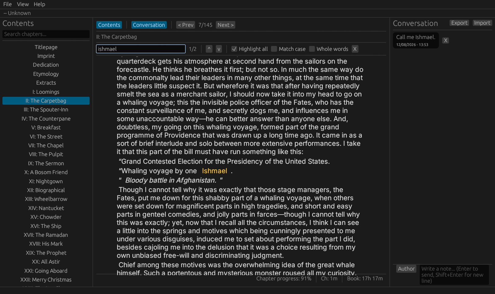

# epubthing
An epub reader

## Features
- Read epub by chapter
- Search text per chapter
- Search in chapters list
- Save text in a Conversation (notes with a chat-like interface)
- Custom fonts
- Custom colors for font and background
- Custom font size
- Custom width (in characters) for the text box 
- Custom text box alignment
- Custom text box scroll speed
- Per book and chapter reading time

## Screenshot

# Download
[Linux (direct download)](https://github.com/plucafs/epubthing/releases/download/v0.1.1/epubthing-linux)

## Credits
- [pi](https://github.com/earendil-works/pi)
- [OpenCode](https://github.com/anomalyco/opencode)

## License
MIT